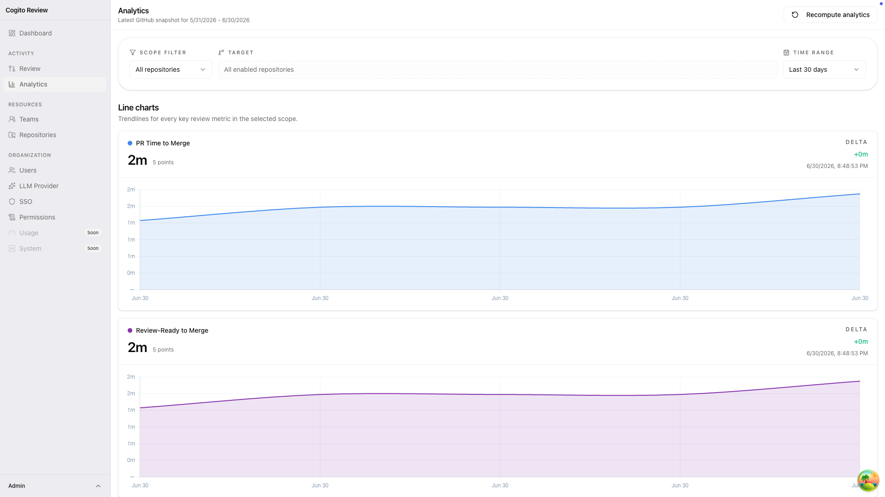
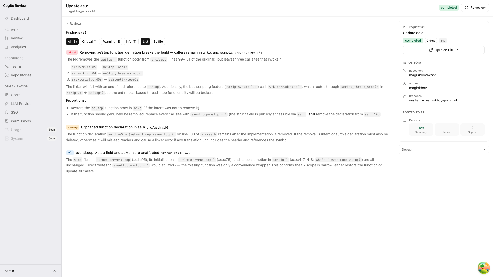
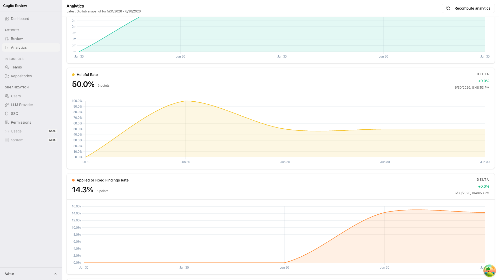
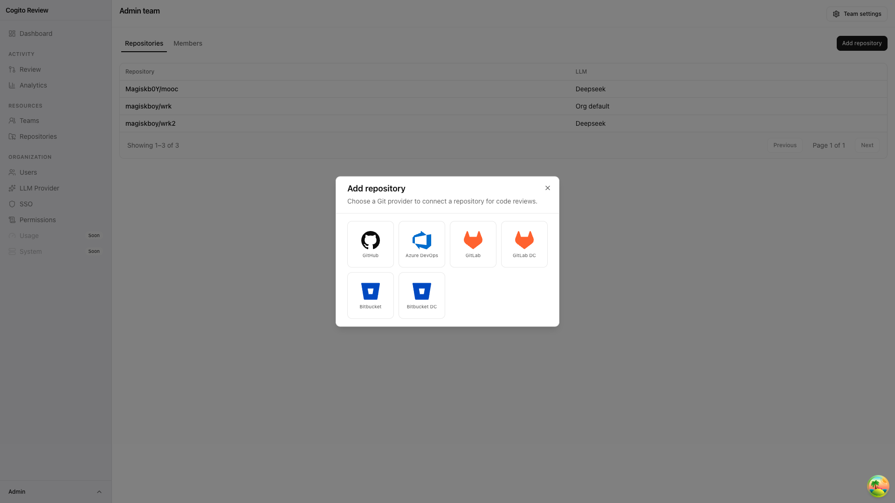
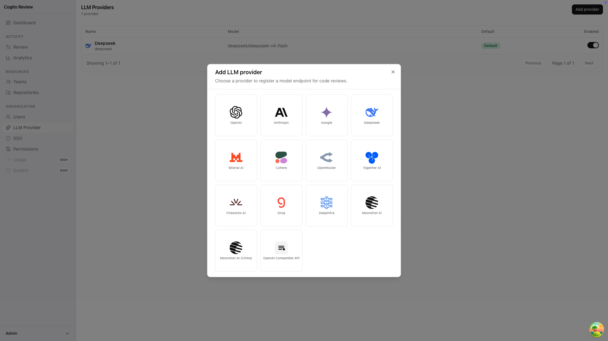
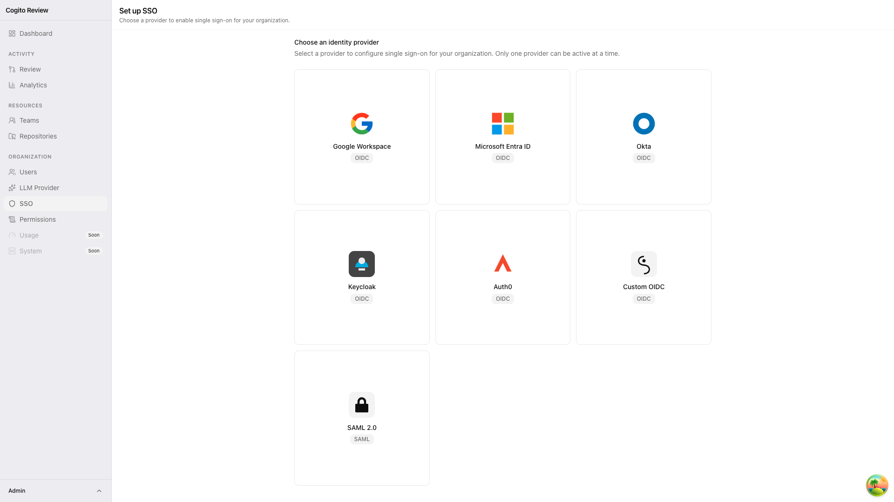
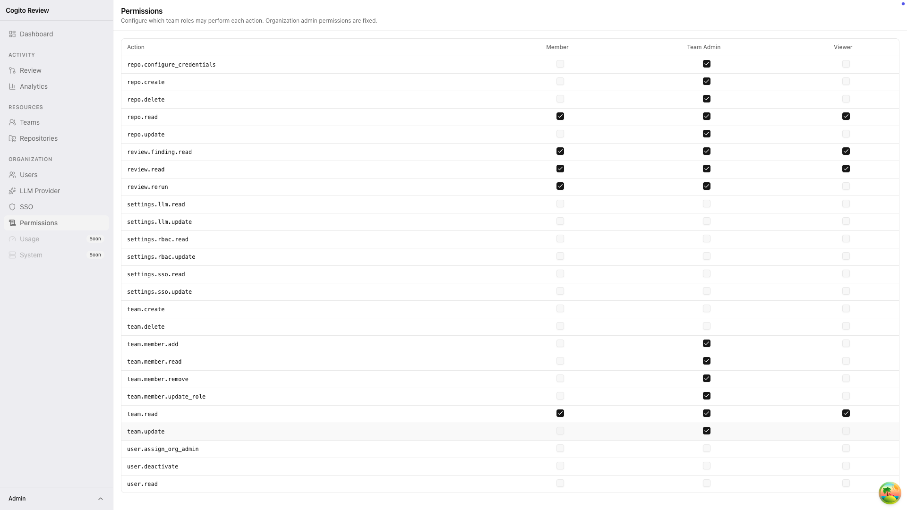

> [!WARNING]
> Cogito Review is currently under active development and is not production-ready yet.
> Expect breaking changes, incomplete features, and operational gaps while the project is evolving.


# Cogito Review

[](https://github.com/CogitoForge-AI/cogito-review/actions/workflows/ci.yml)
[](https://github.com/CogitoForge-AI/cogito-review/actions/workflows/publish.yml)
[](https://github.com/CogitoForge-AI/cogito-review/pkgs/container/cogito-review)
[](https://github.com/CogitoForge-AI/cogito-review/pkgs/container/cogito-review-agent)
[](https://github.com/CogitoForge-AI/cogito-review/pkgs/container/cogito-review-operator)

AI-assisted code review platform for pull requests and merge requests.

Cogito Review helps teams review code faster with automated, structured feedback on pull requests and merge requests. The platform is designed to run entirely as containers, with native Docker deployment for self-hosting and a Kubernetes-native integration path built around a dedicated operator.

## Why teams use Cogito Review

- Review changes automatically when pull requests or merge requests are opened or updated
- Get structured findings with clear severity, location, title, and description
- Keep review history and repository settings in one place
- Choose your own OpenAI-compatible model provider
- Use one system across multiple repositories and teams
- Self-host the product in your own environment
- Deploy the full stack with container-native workflows on Docker or Kubernetes

## Features

- Automatic review runs triggered by repository events
- Structured findings that are easy to scan and triage
- Web UI for review history, findings, repository settings, and model setup
- Repository-level integration settings
- Team and access management
- SSO and RBAC support
- Review retry support
- Multi-provider Git integration
- Container-first architecture with separate backend, agent, and operator images
- Native Docker deployment and Kubernetes-native operator integration

## Showcase

| Analytics overview | Review findings |
| --- | --- |
|  |  |
| Analytics trends | Git providers |
|  |  |
| LLM providers | SSO providers |
|  |  |
| RBAC |  |
|  |  |

## Supported integrations

- Git providers: GitHub, GitLab, Azure DevOps, Bitbucket Cloud, Bitbucket Data Center
- Identity: OIDC, SAML 2.0, and local bootstrap login
- LLM providers: OpenAI-compatible endpoints

## Deployment model

Cogito Review is built as a container-first system. The application stack, review agent, and Kubernetes operator are shipped as separate container images so the platform can fit both simple self-hosted Docker environments and Kubernetes-native platform setups.

### Native Docker

- Run the full stack with Docker Compose
- Keep the API, worker, database dependencies, and review agent flow inside a container-based deployment model
- Use the fastest path for local evaluation and straightforward self-hosting

### Native Kubernetes

- Deploy the platform with Kubernetes manifests in `deploy/k8s/`
- Integrate through the dedicated Cogito Review Kubernetes Operator in `operator/`
- Manage installation and platform resources through Kubernetes-native APIs and CRDs
- Align the deployment model with cluster-native operations and GitOps workflows

## Quick start

### Start the app

```bash
cp .env.example .env
make prod
```

Open the application on `http://localhost:${APP_PORT:-8000}`.

### Set it up

1. Open the web app.
2. Add an LLM provider in `Settings -> LLM Providers`.
3. Add a repository integration in `Settings -> Repositories`.
4. Configure your Git provider webhook to point at the backend.
5. Open or update a pull request or merge request to trigger a review.

### Example GitHub webhook

| Field | Value |
| --- | --- |
| Payload URL | `https://<your-host>/api/v1/webhooks/github` |
| Content type | `application/json` |
| Secret | Match the repository integration secret |
| Events | Pull requests |

## Configuration notes

- Set strong values for `COGITO_REVIEW_SESSION_SECRET`, `COGITO_REVIEW_SECRETS_ENCRYPTION_KEY`, and `COGITO_REVIEW_AGENT_CALLBACK_SECRET` in production
- Prefer pinned image tags or digests over `latest`

## Images

Published container images:

```bash
docker pull ghcr.io/cogitoforge-ai/cogito-review:latest
docker pull ghcr.io/cogitoforge-ai/cogito-review-agent:latest
docker pull ghcr.io/cogitoforge-ai/cogito-review-operator:latest
```

Production deployments should pin a version tag or image digest.

## Documentation

For deeper technical and operational details:

- [Deployment guide](docs/deployment.md)
- [Kubernetes integration](docs/kubernetes.md)
- [Security model](docs/security.md)
- [RBAC model](docs/rbac.md)
- [Architecture overview](docs/architecture-overview.md)
- [Operator guide](operator/README.md)
